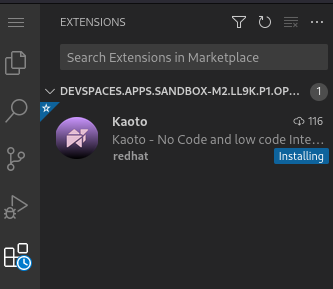

# Minimal environment to have VS Code Kaoto available in DevSpaces

This repository shows the minimal setup to have Red Hat Developer Sandbox setup with VS Code Kaoto to edit graphically a Camel Route.

It does not cover execution. Another repository example will be provided later with more Camel tooling.

After opening the repository in Red Hat OpenShift Dev Spaces, wait for the Kaoto extension to be installed. You can notice that it is mentioning `installing` during this waiting phase.

Then open the demo.camel.yaml file and enjoy the view!
